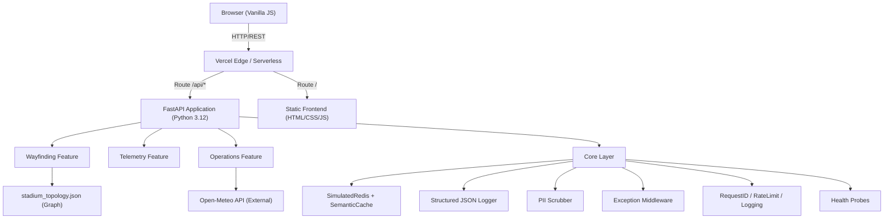

# Nexus26 Architecture

## System Overview

Nexus26 is a monorepo containing a **FastAPI backend** and a **vanilla JS/CSS/HTML frontend**. It is deployed on Vercel as a serverless Python function (backend) and static assets (frontend).



---

## Layer Descriptions

### 1. API Layer (`api/index.py`)
Vercel serverless entry point that imports and exposes the FastAPI `app` object.

### 2. Application Layer (`app/main.py`)
- Configures all middleware in order: CORS → GlobalException → RequestID → RequestLogging → RateLimit
- Registers all feature routers with route prefixes
- Starts background telemetry simulation thread via lifespan context

### 3. Feature Layer (`app/features/`)
Each feature is a self-contained module with:
- `models.py` — Pydantic DTOs (request/response schemas)
- `router.py` — FastAPI route handlers
- `service.py` — Business logic

| Feature | Route Prefix | Responsibility |
|---------|-------------|----------------|
| wayfinding | `/api/navigation` | Dijkstra routing, PII scrubbing, semantic cache |
| telemetry | `/api/telemetry` | Topology graph serving, crowd density ingestion |
| operations | `/api/operations` | Heat index forecasting, resource management, weather |

### 4. Core Layer (`app/core/`)

| Module | Purpose |
|--------|---------|
| `constants.py` | All named constants — no magic numbers anywhere else |
| `cache.py` | `SemanticCache` (TF-IDF + cosine similarity) + `SimulatedRedis` (TTL KV store) |
| `config.py` | `Settings` Pydantic model for environment-based configuration |
| `exceptions.py` | `NexusException` hierarchy + `GlobalExceptionMiddleware` |
| `health.py` | `/health/live` and `/health/ready` probe endpoints |
| `logging.py` | `StructuredJSONFormatter`, `StructuredLoggerAdapter`, `log_execution_time` decorator |
| `middleware.py` | `RequestIDMiddleware`, `RequestLoggingMiddleware`, `RateLimitMiddleware` |
| `security.py` | `scrub_pii()` — regex-based PII redaction |

---

## Data Flow: Wayfinding Request

```
POST /api/navigation/route
   → RequestIDMiddleware (assign UUID)
   → RateLimitMiddleware (check per-IP window)
   → RequestLoggingMiddleware (start timer)
   → GlobalExceptionMiddleware (wrap errors)
   → WayfindingRouter.find_route()
       → scrub_pii(query_text)       # Security
       → redis_client.get_semantic() # Cache lookup
       → RoutingService.calculate_route()  # Dijkstra on stadium graph
       → redis_client.set_semantic() # Cache store
   → RouteResponse (Pydantic serialized)
   → RequestLoggingMiddleware (log duration)
   → X-Request-ID header added to response
```

---

## Caching Strategy

- **Key-Value Cache** (`SimulatedRedis.raw_kv`): Used for weather data with 60s TTL.
- **Semantic Cache** (`SemanticCache`): Used for route queries. Computes TF-IDF vectors and cosine similarity. Threshold: 0.82 (configurable via `SEMANTIC_CACHE_THRESHOLD`).
- **No external Redis**: All caching is in-memory (process-local). State resets on serverless cold starts.

---

## Background Thread

`_run_crowd_telemetry_simulation()` runs as a daemon thread and updates 3–6 random edge densities every `TELEMETRY_SIM_INTERVAL` seconds. This simulates live game-day crowd flow without any external sensors.
